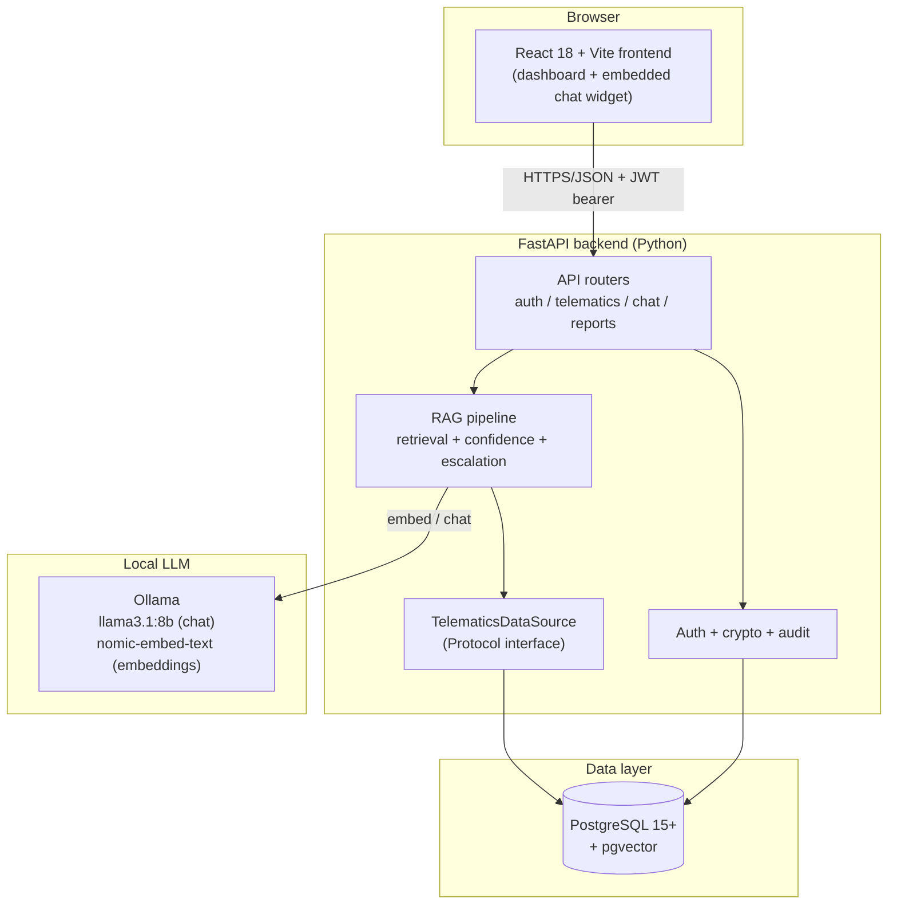

# Architecture

## System overview

## Components

### Frontend (`frontend/`)

React 18 + TypeScript + Vite + Tailwind v4. Two things live in the same
single-page app, per the project's own scope decision to build "full
dashboard + chatbot" rather than a chatbot-only widget:

- **Fleet dashboard** — `Overview`, `Routes`, `Drivers`, `Alerts` pages
  (`frontend/src/pages/`), each reading from the telematics REST endpoints.
- **Embedded chat widget** — `ChatWidget.tsx`, mounted inside the dashboard
  layout rather than as a separate standalone page, so a customer can ask a
  question without leaving whatever screen they're on.

Routing (`frontend/src/App.tsx`) is a single `/login` route plus a protected
shell (`ProtectedRoute` + `Layout`) wrapping `/overview`, `/routes`,
`/drivers`, `/alerts`; any unmatched path redirects to `/overview`. Auth
state lives in `AuthProvider` (JWT stored client-side, attached via
`Authorization: Bearer` on every request — see `lib/apiClient.ts`); there is
no cookie-based session, which is why the backend's CORS config sets
`allow_credentials=False`.

### Backend (`backend/app/`)

FastAPI, organized by concern rather than by REST resource:

| Package | Responsibility |
|---|---|
| `api/` | HTTP route handlers (`auth.py`, `telematics.py`, `chat.py`, `reports.py`) — thin, delegate to `ai/`, `datasources/`, `security/` |
| `ai/` | The RAG pipeline: embeddings, retrieval, confidence scoring, escalation, the (separate, non-RAG) report generators, and route-planning orchestration (`route_planning.py`) |
| `integrations/` | Thin HTTP clients for external services this app depends on but doesn't run itself — OpenRouteService (directions/geocoding) and Open-Meteo (weather). Same "one dedicated client module per external call, no `httpx` above it" discipline as `ai/llm.py`/`ai/embeddings.py`. See [ROUTE_PLANNING.md](ROUTE_PLANNING.md) |
| `datasources/` | `TelematicsDataSource` — the storage-agnostic interface every telematics read goes through |
| `auth/` | Password hashing (bcrypt), JWT issue/verify, the `require_role` dependency |
| `security/` | At-rest PII encryption (`crypto.py`) and audit logging (`audit.py`) |
| `models/` | SQLAlchemy ORM entities (see [DATA_MODEL.md](DATA_MODEL.md)) |
| `repositories/` | Query helpers used by the chat pipeline (session/message persistence) |
| `jobs/` | Background maintenance (`retention.py` — purges expired chat sessions) |
| `seed/` | Synthetic fleet-data generator used to populate a demo/dev database |

### Database

PostgreSQL 15+ with the `pgvector` extension, which backs
`KnowledgeBaseArticle.embedding` (a 768-dimension vector, matching
`nomic-embed-text`'s output size) and the cosine-distance similarity search
used at retrieval time. Migrations are managed with Alembic
(`backend/alembic/`).

### LLM (Ollama)

Runs as its own container/service, reached over the network
(`OLLAMA_BASE_URL`) rather than linked in-process — this is what lets the
backend call `/api/embeddings` and `/api/chat` as plain HTTP without any
Python ML dependencies. Two models are pulled at deploy time:

- `llama3.1:8b` — chat answers and report generation (`OLLAMA_MODEL`)
- `nomic-embed-text` — embeddings for the knowledge base and for queries (`OLLAMA_EMBED_MODEL`)

Chosen over a cloud LLM API specifically so the assistant has no per-request
cost and no external data egress — relevant given the telematics data being
reasoned over is fleet-operational data belonging to Ctrack's customers.

## Why `TelematicsDataSource` is a `Protocol`, not a concrete class

`backend/app/datasources/base.py` defines the interface every telematics
read goes through — `get_driver`, `get_vehicle`, `get_trip`,
`get_trips_for_driver`, `get_driving_events`, `get_knowledge_base_articles`,
`list_drivers`, `list_vehicles`, `list_devices`, `list_trips_for_customer` —
as a `@runtime_checkable` `typing.Protocol`, not an ABC with a required base
class. `SyntheticDataSource` (`datasources/synthetic.py`) is the only
implementation today, reading from the seeded PostgreSQL tables with
direct-column or transitive-join tenant scoping.

This exists specifically to keep the door open for a second implementation
backed by Ctrack's real Databricks telematics data, without requiring the
callers in `ai/`, `api/telematics.py`, or `api/reports.py` to change: they
depend only on the `TelematicsDataSource` shape, never on
`SyntheticDataSource` directly. **As of this writing, no
`DatabricksDataSource` exists** — connecting to Databricks was scoped as a
follow-on integration (it requires manual VPN login to Ctrack's Azure
Databricks workspace and was not something to guess the schema or auth
model for) and remains a planned next step, not a shipped feature.

## Request flow: a chat question end-to-end

1. Frontend `ChatWidget` sends `POST /chat` with the customer's message,
   JWT in the `Authorization` header, and optional `driver_id` / `vehicle_id`
   / `trip_id` context (plus `device_id` for a brand-new session).
2. `app/api/chat.py` resolves or creates the `ChatSession`, and derives
   `customer_id` from the session — **never from the request body** (see
   [SECURITY.md](SECURITY.md) for why this matters).
3. Two lightweight keyword checks run before RAG, in order: `_detect_route_plan_intent`
   (is this "plan a trip from X to Y"?) then `_detect_report_intent` (is this
   a start-of-day/end-of-day report request?). A match routes straight to
   `ai/route_planning.py` or `ai/reports.py` respectively — both
   deliberately bypass RAG, since both are "always delivered, not
   confidence-gated" by design. See [ROUTE_PLANNING.md](ROUTE_PLANNING.md)
   for the route-planning path in full.
4. Otherwise, `ai/retrieval.py` embeds the query, does a `pgvector`
   cosine-distance top-k search against `knowledge_base_articles`, and
   pulls any relevant driver/vehicle/trip/driving-event context via the
   `TelematicsDataSource`.
5. `ai/chat_service.py` sends the retrieved context + query to Ollama with a
   strict "answer only from context" system prompt, and computes a
   confidence score for the answer.
6. `ai/escalation.py` checks that confidence against
   `ESCALATION_CONFIDENCE_THRESHOLD` (default `0.6`). Below it, the answer
   is replaced with a fixed fallback string and a `SupportTicket` is
   auto-created; at or above it, the LLM's answer is returned as-is.
7. The exchange (question + answer + confidence + escalation outcome) is
   persisted as `ChatMessage` rows and recorded in `audit_logs` — all in a
   single commit per request (see [RAG_PIPELINE.md](RAG_PIPELINE.md) and
   [SECURITY.md](SECURITY.md)).

See [RAG_PIPELINE.md](RAG_PIPELINE.md) for the full detail on steps 3–7,
including the confidence formula and the known scope limits of the RAG
approach (e.g. it cannot answer fleet-wide aggregate/count questions).
