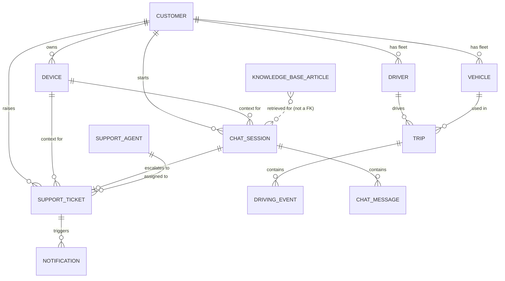

# Data Model

13 SQLAlchemy entities (`backend/app/models/`), migrated with Alembic
(`backend/alembic/`). All primary keys are auto-incrementing integers named
`<entity>_id`. All enum columns are Python `str` `Enum` subclasses
(`app/models/enums.py`), stored as their lowercase `.value` in Postgres.

## Entity-relationship diagram

`KNOWLEDGE_BASE_ARTICLE` has no foreign key to anything — it's the global RAG
corpus, retrieved by vector similarity, not joined by ID.

## Entities

### Customer

A fleet customer who owns devices and can chat with / raise tickets to
support.

| Field | Type | Notes |
|---|---|---|
| `customer_id` | int, PK | |
| `full_name` | encrypted string | AES-256-GCM at rest (randomized) |
| `email` | encrypted string, unique | AES-SIV at rest (deterministic — see [SECURITY.md](SECURITY.md)) |
| `phone_number` | encrypted string | AES-256-GCM at rest (randomized) |
| `preferred_notification_method` | enum | `email` / `sms` / `push` / `in_app`, default `email` |
| `password_hash` | string | bcrypt |
| `created_at` / `updated_at` | timestamptz | |

### Device

A telematics device installed in a customer's vehicle.

| Field | Type | Notes |
|---|---|---|
| `device_id` | int, PK | |
| `customer_id` | int, FK → Customer | |
| `serial_number` | string, unique | |
| `device_type` | string | |
| `battery_status` | enum | `ok` / `low` / `critical`, default `ok` |
| `signal_strength` | int, nullable | 0–100 |
| `last_seen` | timestamptz, nullable | |
| `device_status` | enum | `active` / `inactive` / `maintenance` / `offline`, default `active` |
| `installed_at` | timestamptz, nullable | |
| `created_at` | timestamptz | |

### Driver

Belongs to one customer's fleet.

| Field | Type | Notes |
|---|---|---|
| `driver_id` | int, PK | |
| `customer_id` | int, FK → Customer | added in migration `f047842cb6ff → 054e88c6af09` for fleet isolation |
| `full_name` | string | |
| `license_number` | string, unique | |
| `email`, `phone_number` | string, nullable | not encrypted (unlike Customer's PII) |
| `created_at` | timestamptz | |

### Vehicle

Belongs to one customer's fleet.

| Field | Type | Notes |
|---|---|---|
| `vehicle_id` | int, PK | |
| `customer_id` | int, FK → Customer | same fleet-isolation migration as Driver |
| `registration_number` | string, unique | |
| `make`, `model` | string | |
| `year` | int | |
| `created_at` | timestamptz | |

### Trip

A single trip made by a driver in a vehicle. Scoped to a customer
*transitively* (via `driver_id`/`vehicle_id`), not by its own `customer_id`
column.

| Field | Type | Notes |
|---|---|---|
| `trip_id` | int, PK | |
| `driver_id` | int, FK → Driver | |
| `vehicle_id` | int, FK → Vehicle | |
| `start_time` | timestamptz | |
| `end_time` | timestamptz, nullable | |
| `start_location`, `end_location` | string, nullable | |
| `distance_km` | numeric(10,2), nullable | |
| `created_at` | timestamptz | |

### DrivingEvent

A discrete event detected within a trip.

| Field | Type | Notes |
|---|---|---|
| `driving_event_id` | int, PK | |
| `trip_id` | int, FK → Trip | |
| `event_type` | enum | `speeding` / `harsh_braking` / `idling` / `route_deviation` |
| `event_time` | timestamptz | |
| `location` | string, nullable | free-text label (e.g. "Main Rd") — not a coordinate |
| `latitude`, `longitude` | float, nullable | added by the [route-planning feature](ROUTE_PLANNING.md); nullable because no coordinate source existed before it. Populated for synthetic seed data via `app/seed/generator.py`'s `DEMO_CORRIDORS`; real-world rows have no writer for these columns yet |
| `details` | string(1024), nullable | |
| `created_at` | timestamptz | |

### ChatSession

One conversation between a customer (via a device context) and the AI
assistant.

| Field | Type | Notes |
|---|---|---|
| `chat_session_id` | int, PK | |
| `customer_id` | int, FK → Customer | |
| `device_id` | int, FK → Device | required to start a *new* session |
| `session_status` | enum | `active` / `ended`, default `active` |
| `start_time` | timestamptz | |
| `end_time` | timestamptz, nullable | |
| `ai_confidence_score` | float, nullable | most recent answer's confidence |
| `ces_score` | int, nullable | Customer Effort Score, set once via `POST /chat/sessions/{id}/survey`; range validated at the API layer, not the model |
| `created_at` | timestamptz | |

### ChatMessage

A single message (user question or assistant response) within a
ChatSession.

| Field | Type | Notes |
|---|---|---|
| `chat_message_id` | int, PK | |
| `chat_session_id` | int, FK → ChatSession, `ON DELETE CASCADE` | |
| `role` | enum | `user` / `assistant` |
| `content` | text | |
| `feedback` | bool, nullable | thumbs-up (`true`) / thumbs-down (`false`) / none given (`null`); only meaningful on `role=assistant` rows |
| `created_at` | timestamptz | |

### SupportTicket

A human-support escalation, created from at most one ChatSession
(`chat_session_id` is unique).

| Field | Type | Notes |
|---|---|---|
| `support_ticket_id` | int, PK | |
| `chat_session_id` | int, FK → ChatSession, unique | |
| `customer_id` | int, FK → Customer | |
| `device_id` | int, FK → Device | |
| `assigned_support_agent_id` | int, FK → SupportAgent, nullable | |
| `ticket_status` | enum | `open` / `in_progress` / `resolved` / `closed`, default `open` |
| `priority` | enum | `low` / `medium` / `high` / `urgent`, default `medium` |
| `subject`, `description` | string/text, nullable | |
| `created_at` | timestamptz | |
| `resolved_at` | timestamptz, nullable | |

### Notification

A notification sent to a customer about a SupportTicket's progress.

| Field | Type | Notes |
|---|---|---|
| `notification_id` | int, PK | |
| `support_ticket_id` | int, FK → SupportTicket | |
| `customer_id` | int, FK → Customer | |
| `notification_type` | enum | reuses `PreferredNotificationMethod` |
| `message` | text | |
| `sent_at` | timestamptz, nullable | |
| `created_at` | timestamptz | |

### SupportAgent

A human support agent who can be assigned SupportTicket records.

| Field | Type | Notes |
|---|---|---|
| `support_agent_id` | int, PK | |
| `full_name` | string | |
| `email` | string, unique | not encrypted (unlike Customer.email) |
| `access_level` | enum | `tier_1` / `tier_2` / `admin`, default `tier_1` |
| `password_hash` | string | bcrypt |
| `created_at` | timestamptz | |

### KnowledgeBaseArticle

The RAG corpus — troubleshooting guides / FAQs. Not linked to any customer;
this is shared/global content.

| Field | Type | Notes |
|---|---|---|
| `knowledge_base_article_id` | int, PK | |
| `title` | string(255) | |
| `content` | text | the only field actually embedded (title/category are not) |
| `category` | string(128), nullable | |
| `embedding` | `vector(768)`, nullable | pgvector column; null until indexed, dimension matches `nomic-embed-text` |
| `created_at` / `updated_at` | timestamptz | |

### AuditLog

One audited event per AI-generated recommendation shown to a user (a chat
answer or a generated report).

| Field | Type | Notes |
|---|---|---|
| `audit_log_id` | int, PK | |
| `actor_id` | int, nullable | nullable to allow a future system-initiated action with no human actor |
| `actor_role` | string(32) | `"customer"` / `"support_agent"` today |
| `action` | string(64) | plain string, not a DB enum, so new action types never need a migration — see `app/security/audit.py` for current constants (`chat_answer`, `report_generated`) |
| `description` | text, nullable | |
| `created_at` | timestamptz | |
