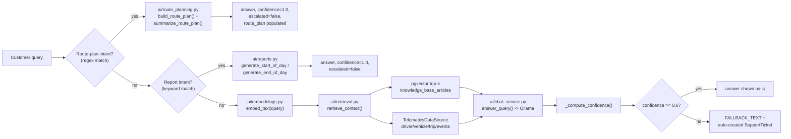

# RAG Pipeline

How `POST /chat` turns a customer's question into an answer, and how it
decides whether to trust that answer enough to show it.

## Overview

## Step 0: route-plan intent routing (bypasses RAG entirely, checked first)

Runs before the report-intent check below — see
[ROUTE_PLANNING.md](ROUTE_PLANNING.md#chat-integration) for the full regex
and behavior. Matches phrases like `"plan a trip from X to Y"`. Checked
first because its keyword set is more specific than the report check's.

## Step 1: report-intent routing (bypasses RAG entirely)

Before anything else *except* the route-plan check above,
`app/api/chat.py`'s `_detect_report_intent` does a plain substring check on
the lowercased query:

- Matches `"start of day"`, `"start-of-day"`, `"morning report"`, `"morning
  summary"` → routes to `generate_start_of_day_report`.
- Otherwise matches `"report"`, `"summary"`, `"daily digest"` → routes to
  `generate_end_of_day_report`.
- No match → falls through to RAG (step 2 onward).

**Known live gotcha**: this is a plain *substring* check, not a
word-boundary one — `"report"` matches inside `"reported"`. A genuine
question like *"my device hasn't reported its location in days"* gets
hijacked into a report response instead of answering the real question.
Confirmed live; not yet fixed (word-boundary regex, e.g. `\breport(s|ed|ing)?\b`
tuned to still catch "report"/"reports" but not swallow unrelated words, is
the straightforward fix). Avoid the literal substring `"report"` in
questions that aren't actually report requests until this is tightened.

This exists because the report generators (`app/ai/reports.py`) were built
as standalone functions and were never wired into the chat pipeline — a
real user asking "give me the daily report" through the widget used to fall
through to RAG, find no matching knowledge-base article, and get the
escalation fallback text. Reports are deliberately **not** RAG — no
retrieval, no confidence gate, "always delivered" per `reports.py`'s own
module docstring — so a matched report intent always returns
`confidence: 1.0, escalated: false` unconditionally, skipping steps 2–4
below.

## Step 2: retrieval (`app/ai/retrieval.py`)

`retrieve_context(query, driver_id, trip_id, vehicle_id, customer_id, top_k=3, db)`
does two independent lookups:

1. **Knowledge base**: embeds the query via Ollama (`embed_text`, using
   `nomic-embed-text`), then runs a pgvector cosine-distance `ORDER BY ...
   LIMIT top_k` query against `knowledge_base_articles` — no `WHERE` clause,
   no relevance cutoff. It **always** returns up to `top_k` rows if the KB
   has that many, however semantically distant they actually are from the
   query. The cosine *similarity* (not distance) of each returned article is
   also computed client-side and threaded through as
   `RetrievedContext.article_similarities`, specifically so the confidence
   step below can tell "found 3 highly relevant articles" apart from "found
   3 irrelevant ones."
2. **Telematics context**: for whichever of `driver_id`/`vehicle_id`/
   `trip_id` were passed, pulls the corresponding row(s) through the
   `TelematicsDataSource` interface — always passing `customer_id` so a
   cross-tenant id can never resolve to another customer's data. Passing
   `trip_id` also pulls that trip's `DrivingEvent`s. The three ids are
   independent: passing only `trip_id` does not also populate
   `driver`/`vehicle`.

## Step 3: answer generation (`app/ai/chat_service.py`)

`answer_query(query, retrieved_context)` builds a prompt with a strict
system message:

> "Answer the user's question using ONLY the information given in the
> 'Context' section... If the context does not contain enough information to
> answer the question, you MUST reply with exactly this sentence and nothing
> else: 'I am unable to find that information'"

`FALLBACK_TEXT = "I am unable to find that information"` is an exact,
load-bearing string — the escalation and confidence logic both pattern-match
against it verbatim, so it must never be reworded. The user message embeds
the actual retrieved article titles/content and any resolved
driver/vehicle/trip/driving-event data (never a placeholder). This is sent
to Ollama (`app/ai/llm.py`'s `chat_completion`, the only module that
actually calls Ollama's `/api/chat`).

## Step 4: confidence scoring

Ollama's `/api/chat` exposes no logprobs, so confidence is a **heuristic**,
not a calibrated model probability. `_compute_confidence` in
`chat_service.py`:

1. If nothing was retrieved at all (no articles, no telematics rows):
   confidence = **0.1** (fixed floor), regardless of what the LLM said.
2. Otherwise, start from a base of **0.35** and add:
   - **Article relevance bonus** (up to +0.45): only if the *best* retrieved
     article's cosine similarity exceeds `_ARTICLE_RELEVANCE_FLOOR = 0.3`.
     Below that floor, a pile of retrieved-but-irrelevant articles earns
     nothing — this exists specifically because the retrieval query has no
     relevance cutoff and always returns `top_k` rows, so "N articles came
     back" on its own says nothing about relevance. Above the floor, the
     bonus scales linearly with similarity: `0.15 × min(article_count, 3) ×
     ((best_similarity − 0.3) / 0.7)`.
   - **Telematics bonus** (+0.15 flat): if any driver/vehicle/trip/driving-event
     data was resolved at all — a boolean bump, no partial credit.
   - Capped at **0.95**.
3. **Fallback override**: if the LLM's answer text contains `FALLBACK_TEXT`
   anywhere, confidence is capped at **0.1** regardless of the above — the
   model reporting "I can't answer this" is the strongest available signal,
   even if retrieval technically found *something*.

## Step 5: escalation gate (`app/ai/escalation.py`)

`handle_answer` compares `confidence` against
`ESCALATION_CONFIDENCE_THRESHOLD` (env-configurable, default **0.6**):

- **At or above threshold**: the LLM's answer is returned to the customer
  unchanged. No ticket, no notification.
- **Below threshold**: the customer-facing text is replaced with the exact
  `FALLBACK_TEXT`, and a `SupportTicket` + `Notification` are created so a
  human agent can pick it up. Escalation is **idempotent per session** — if
  the same `ChatSession` produces a second low-confidence answer, the
  existing ticket is reused (a `SELECT`-first check, with an
  `IntegrityError`-safe retry under a SAVEPOINT for the concurrent-request
  case) rather than raising a DB constraint violation on the second insert.

Separately, a customer can also manually escalate any *specific* answer by
giving it a thumbs-down (`PATCH /chat/messages/{id}/feedback`), which
creates a ticket through the same idempotent pattern — see
[API_REFERENCE.md](API_REFERENCE.md).

## Atomicity

Everything in one `POST /chat` call — session creation/lookup, the two
`ChatMessage` rows (user + assistant), any escalation `SupportTicket`/
`Notification`, and the `AuditLog` row — is staged with `db.flush()` and
committed **exactly once**, at the very end of the request. This closes a
real bug where each piece used to commit separately: a failure between (say)
the ticket commit and the message commit could strand a `SupportTicket`
pointing at a session with zero messages for a support agent to act on.

## Known scope limits

The RAG approach here is **retrieval over a fixed knowledge base +
single-entity telematics lookups**. Two categories of question it genuinely
cannot answer, discovered from a real user session:

1. **Fleet-wide aggregate/count questions** — e.g. "how many Toyota Hilux do
   we have?" There is no aggregation step anywhere in the pipeline;
   `retrieve_context` only ever resolves a *single* driver/vehicle/trip by
   id, never "all vehicles matching X." Answering this class of question
   would require a new capability (e.g. a structured query/aggregation tool
   the LLM can invoke, or a dedicated fleet-stats endpoint), not a prompt
   tweak — this was intentionally not hacked around and remains an open
   product decision.
2. **Vague or under-specified questions**: the confidence formula will
   correctly return a low score (and thus escalate) for a question that
   retrieval genuinely can't ground an answer for. This is working as
   designed (the ASS2 requirement is an explicit anti-hallucination
   fallback, not a bug), but it also means a vague question reads to the
   user as "the bot doesn't know anything" rather than "please be more
   specific" — there's no query-clarification step in this pipeline.
