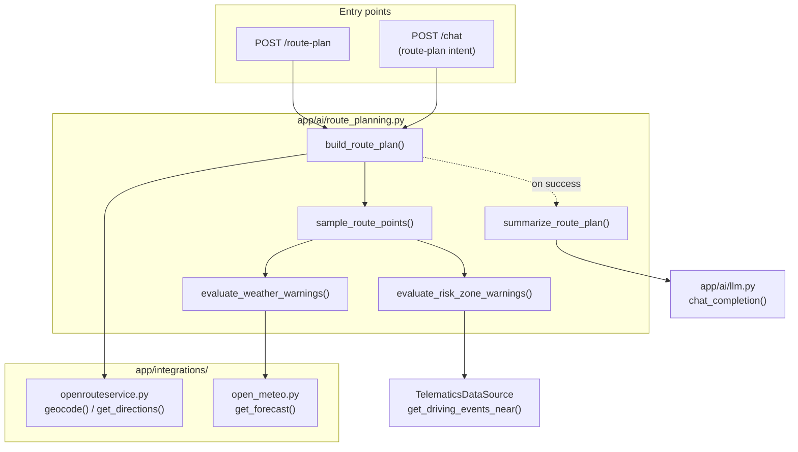

# Route Planning + Route Warnings

How a customer or support agent gets a route computed, checked for weather
and historical-risk-zone warnings, and summarized — either via a dedicated
endpoint or by just asking the chat assistant.

Design spec: `docs/superpowers/specs/2026-08-26-route-planning-warnings-design.md`.
Implementation plan (with full task-by-task TDD history):
`docs/superpowers/plans/2026-08-26-route-planning-warnings.md`.

## What it does

Given an origin and a destination (place names or raw coordinates), the
system:

1. Geocodes any place names and computes a real driving route via
   **OpenRouteService**.
2. Samples ~8 points evenly along the route.
3. Checks each point against **Open-Meteo** for a weather hazard
   (heavy rain, strong wind, low visibility).
4. Checks each point against this fleet's **historical driving events**
   (harsh braking, speeding, route deviation) for a "risk zone" — a road
   segment with an unusually high concentration of past incidents.
5. Returns the raw structured result (distance, duration, geometry,
   warnings) **and** an LLM-generated natural-language summary.

This is reachable two ways, both backed by the exact same code:

- **`POST /route-plan`** — a direct API call, for a map UI or a script.
- **The chat assistant** — ask `"plan a trip from Sydney CBD to Parramatta"`
  and `POST /chat` routes the request here instead of into RAG.

## Architecture



Every external HTTP call lives in one of two dedicated client modules
(`app/integrations/openrouteservice.py`, `app/integrations/open_meteo.py`)
— nothing above them touches `httpx` directly, matching this codebase's
existing pattern for `app/ai/llm.py` and `app/ai/embeddings.py`.

## The pipeline, step by step

### 1. Geocoding + directions (`app/integrations/openrouteservice.py`)

- `geocode(place_name) -> Coordinates` — resolves a free-text place name via
  ORS's Pelias-based geocoding endpoint.
- `get_directions(origin, destination, waypoints=None) -> RouteResult` —
  fetches a real driving route (GeoJSON `LineString` geometry, distance,
  duration).
- Both authenticate via an `Authorization` header carrying `ORS_API_KEY`
  (see [Security notes](#security-notes) below for why it's a header, not a
  query parameter).
- **GeoJSON coordinate order is `[longitude, latitude]`** — the opposite of
  this module's own `Coordinates(latitude, longitude)` dataclass. Every
  boundary crossing (parsing a geocode response, building a directions
  request) swaps explicitly; this is the single easiest thing to get wrong
  when touching this file.

### 2. Sampling (`sample_route_points`, `app/ai/route_planning.py`)

Extracts up to 8 evenly-spaced points along the route's `LineString`
coordinates, each carrying its straight-line distance from the origin.
Short routes (≤8 points) return every point as-is.

### 3. Weather warnings (`evaluate_weather_warnings`)

Calls `open_meteo.get_forecast(lat, lon)` for each sample point. A point is
flagged (at most one warning per point — first threshold crossed wins) when:

| Condition | Threshold |
|---|---|
| Precipitation probability | > 60% (> 80% = `high` severity) |
| Wind speed | > 40 km/h |
| Visibility | < 1000 m |

A weather-lookup failure for one point is swallowed (that point just isn't
flagged) — it never fails the whole route.

**`get_forecast` selects the correct hour, not index 0.** Open-Meteo's
`hourly` array starts at 00:00 UTC of the request day, not "now" — reading
index 0 blindly (an early version of this code did) could be up to ~24
hours stale. `_select_current_hour_index` walks the returned `hourly.time`
array and picks the first entry at or after the current UTC hour;
`forecast_days=2` is requested (not 1) so a late-evening request still has
an upcoming hour to find.

### 4. Risk-zone warnings (`evaluate_risk_zone_warnings`)

For each sample point, calls
`TelematicsDataSource.get_driving_events_near(lat, lon, radius_km)` and
flags the point if the event count reaches a threshold:

| Constant | Value |
|---|---|
| `RISK_ZONE_RADIUS_KM` | 0.5 |
| `RISK_ZONE_EVENT_THRESHOLD` | 10 (flags as `moderate`) |
| `RISK_ZONE_HIGH_SEVERITY_THRESHOLD` | 14 (flags as `high`) |

The description names the dominant event type and count (e.g. "12 driving
events recorded within 500m of this point (8 harsh braking)").

**These numbers were empirically tuned, not guessed.** See
[Demo corridors and known limitations](#demo-corridors-and-known-limitations)
below — the first version (1.0km / 3 events) flagged every single sampled
point on every demo route, which carries no information at all.

**`get_driving_events_near` is deliberately not customer-scoped** — see
[SECURITY.md](SECURITY.md#risk-zone-lookups-are-not-tenant-scoped-a-deliberate-exception)
for why, and don't "fix" this without reading that first.

### 5. Assembling the result (`build_route_plan`)

The single entry point everything else calls. Resolves origin/destination
(geocoding any string), fetches the route, runs both warning evaluators,
and returns one `RoutePlanResult`. **Never raises** — every downstream
failure degrades to `unavailable=True` instead of propagating, distinguished
by `unavailable_reason`:

| `unavailable_reason` | Cause | User-facing message |
|---|---|---|
| `"geocoding_failed"` | A place name didn't resolve (typo, too vague) | *"I couldn't find a location matching '{place}' — please check the spelling or try a more specific name."* |
| `"service_unavailable"` | ORS/Open-Meteo outage, missing `ORS_API_KEY`, or a database failure while checking risk zones | *"I can't retrieve route data right now — please try again shortly."* |

These are deliberately different messages: retrying fixes a genuine outage
but can never fix a misspelled place name, so conflating the two into one
generic "try again" message is actively unhelpful. `GeocodingError` is
caught **before** its `RouteServiceError` parent specifically so this
distinction survives (see the exception hierarchy in
`openrouteservice.py`).

### 6. Natural-language summary (`summarize_route_plan`)

Builds a prompt instructing the LLM to restate — never invent — the
distance, duration, and warnings already computed, and calls
`app.ai.llm.chat_completion` (the same single LLM-call module every other
AI path in this codebase uses). Only called when `unavailable is False`.

## API (`POST /route-plan`)

```json
// Request
{
  "origin": "Sydney CBD",
  "destination": "Parramatta",
  "waypoints": null
}
```

`origin`/`destination`/each `waypoints` entry accept either a place-name
string (geocoded server-side) or `{"lat": ..., "lon": ...}` — so a frontend
with exact coordinates and a chat request with only a place name both work
through the same endpoint.

```json
// Response (success)
{
  "distance_km": 24.14,
  "duration_min": 27.6,
  "geometry": { "type": "LineString", "coordinates": [[151.21, -33.87], ...] },
  "warnings": [
    {
      "location": { "lat": -33.84, "lon": 151.02 },
      "distance_from_origin_km": 12.1,
      "type": "risk_zone",
      "severity": "moderate",
      "description": "11 driving events recorded within 500m of this point (7 harsh braking)."
    }
  ],
  "unavailable": false,
  "unavailable_reason": null,
  "unavailable_message": null
}
```

```json
// Response (failure -- always HTTP 200, never a 5xx)
{
  "distance_km": null, "duration_min": null, "geometry": null, "warnings": [],
  "unavailable": true,
  "unavailable_reason": "geocoding_failed",
  "unavailable_message": "I couldn't find a location matching 'Parramattaa' -- please check the spelling or try a more specific name."
}
```

RBAC: `require_role("customer", "support_agent")` — the same gate every
other route uses. No `customer_id` scoping on this endpoint's own logic,
since route/weather/risk-zone data isn't customer-owned. Every call
(success or failure) writes an `AuditLog` row
(`action="route_plan_generated"`, noting origin/destination/outcome).

## Chat integration

`app/api/chat.py`'s `_detect_route_plan_intent` runs a regex check on the
query, **before** the existing report-intent check (route-plan phrasings
are more specific):

- `"plan a trip from X to Y"`, `"route from X to Y"`, `"directions from X
  to Y"` → both origin and destination captured.
- `"directions to Z"`, `"route to Z"`, `"warnings on the route to Z"` →
  destination only.

If only a destination is found, the assistant asks a deterministic
clarifying question ("Which starting point should I plan this route
from?") rather than guessing — no `build_route_plan` call happens.

The destination/origin capture stops at a stop-word boundary (`tomorrow`,
`please`, `and`, punctuation, end-of-string, …) rather than running to the
end of the sentence — otherwise `"...to Parramatta tomorrow morning"`
would capture `"Parramatta tomorrow morning"` as the place name and fail to
geocode.

**Known false-positive risk, not fully closed**: the "destination-only"
pattern still contains the bare keyword `drive to`, so a sentence like
*"how many trips did the driver drive to the depot last week"* can still
misfire as a route-plan request instead of falling through to RAG. The
`"plan a trip from X to Y"` pattern (the one the demo scripts actually use)
does **not** have this problem — it was narrowed to `plan (a) trip|route|
directions?`, dropping bare `drive`. If you hit false positives from the
destination-only pattern in practice, tighten its keyword list the same
way.

When the intent fires, `ChatResponse` gains a `route_plan` field
(`RoutePlanResponse | None`) — populated **only** on a successful
route-plan turn, `null` on every other kind of turn (report, RAG,
clarifying question, or a failed route plan). The persisted
`ChatMessage.content` is just the natural-language summary text, same as
every other assistant turn; the structured `route_plan` payload is
transient (regenerable from the same inputs), not stored.

Route-plan turns bypass RAG/escalation entirely — same "always delivered,
not confidence-gated" design as the pre-existing report-intent routing.
A failed route plan (`unavailable=True`) shows the specific
`unavailable_message` — it does **not** auto-create a `SupportTicket` the
way a low-confidence RAG answer does, since an ORS outage or a typo is an
infrastructure/input problem, not a knowledge gap.

## Frontend

`frontend/src/components/RouteMap.tsx` renders the route as a Leaflet
polyline over OpenStreetMap tiles (no API key needed for the tiles), with a
color-coded `CircleMarker` per warning (`weather` = blue, `risk_zone` =
red) showing its description in a popup on click. Coordinates are swapped
from GeoJSON `[lon, lat]` to Leaflet's `[lat, lon]` at the component
boundary.

`ChatWidget.tsx` renders `RouteMap` inline, beside the message transcript,
**only when the actual last message** in the conversation carries a
`route_plan` — the widget widens from `w-80` to `w-[44rem]` for exactly
that turn and reverts on the next ordinary reply. (An earlier version
computed "the most recent message that ever had a route_plan", which stuck
the map open for the rest of the session even after an unrelated follow-up
question — fixed during final review; if you're extending this component,
keep using `messages[messages.length - 1]`, not a backward search.)

Uses `react-leaflet@4.2.1`, pinned deliberately — `react-leaflet@5`
requires React 19, and this project is on React 18.

## Security notes

- **`ORS_API_KEY`** is read once from `app.config.settings.ors_api_key`
  (default `""`, never hardcoded) and sent via the `Authorization` header
  for both `geocode` and `get_directions`. It was originally sent as a
  `geocode` query parameter — that leaked the key into application logs
  and exception messages whenever ORS returned an HTTP error (the error's
  `str()` includes the full request URL, query string and all). Never move
  it back to a query parameter.
- An **empty key fails fast** with a clear log line
  (`"ORS_API_KEY is not configured"`) rather than sending an empty
  `Authorization` header and getting a generic 403 from ORS that's
  indistinguishable from a real outage in the logs.
- **`get_driving_events_near` is not customer-scoped** — a deliberate,
  documented exception to this codebase's otherwise-universal
  tenant-isolation rule. Full reasoning in
  [SECURITY.md](SECURITY.md#risk-zone-lookups-are-not-tenant-scoped-a-deliberate-exception).
- A DB failure during risk-zone evaluation degrades to
  `unavailable=True`/`"service_unavailable"` rather than a 500 — the same
  graceful-degradation contract as an ORS/Open-Meteo outage.

## Demo corridors and known limitations

Three fixed, real Sydney corridors are the only hardcoded geography in this
feature, both as the seed generator's synthetic-event placement and as
tested demo routes:

1. Sydney CBD → Parramatta (~19 km)
2. Sydney CBD → Sydney Airport (~8 km)
3. Sydney CBD → Bondi Beach (~6 km)

`app/seed/generator.py`'s `DEMO_CORRIDORS` + `_point_along_corridor` places
each synthetic `DrivingEvent`'s `latitude`/`longitude` near a random point
on a random corridor (jittered ~300m), so a route computed along one of
these three actually has a chance of passing near seeded risk-zone events.
**Any other origin/destination pair will very likely show zero risk-zone
warnings** — there's no seeded data anywhere else.

**Risk-zone signal is intentionally imperfect, not broken.** At the tuned
thresholds (0.5km / 10 events), the three corridors flag 1/8, 2/8, and 3/8
sample points respectively against the seed data's default
`generate_seed_data()` run. The Parramatta corridor is ~3x longer than the
other two with the same total event count, so its seeded events are
genuinely sparser — no single (radius, threshold) pair makes all three
corridors land in the same "selective, not universal" range simultaneously.
This is a data-density limitation in the seed generator, not the warning
logic; a real fix would place more events along longer corridors
proportionally, or place events along real road geometry instead of a
straight line (the current jitter is around the straight line between two
corridor endpoints — a live-computed ORS route can deviate from that line,
so a real route may sample fewer nearby events than the tuning numbers
above suggest).

**Weather warnings are opportunistic, not demo-controllable.** Real,
live Open-Meteo data — there is no way to force a rain warning to appear on
demand. Confirm live before presenting if you need one to show.

**A fresh seed run needs indexing before RAG-adjacent features work at
all** — this bit the first live deployment test of this feature: `python -m
app.seed.seed` inserts `KnowledgeBaseArticle` rows with `embedding=None`;
nothing populates them automatically. Run
`app.ai.index_kb.index_knowledge_base(db)` after every fresh seed, or
retrieval-based confidence scoring (not this feature specifically, but
the RAG chat path this feature's chat intent sits beside) will silently
return near-random results. Not part of this feature's own code, but
easy to forget when standing up a fresh demo environment.

## Testing

Every external call (`httpx.get`/`httpx.post` for ORS and Open-Meteo, and
`chat_completion` for the LLM) is mocked in tests — no live network access
required. Backend tests: `test_geo.py`, `test_openrouteservice.py`,
`test_open_meteo.py`, `test_datasource.py` (risk-zone lookup),
`test_route_planning.py` + `test_route_planning_risk_zones.py` +
`test_build_route_plan.py` (orchestration), `test_route_plan_api.py`,
`test_chat_api.py` (intent routing). Frontend: `RouteMap.test.tsx` (mocks
`react-leaflet` entirely — jsdom can't render real Leaflet DOM),
`ChatWidget.test.tsx` (mocks `RouteMap`, including a regression test for
the sticky-panel bug above).

To exercise the real, live pipeline (real ORS, real Open-Meteo, real
Ollama) rather than the mocked test suite, see
[DEPLOYMENT.md](DEPLOYMENT.md#route-planning-feature-setup).
